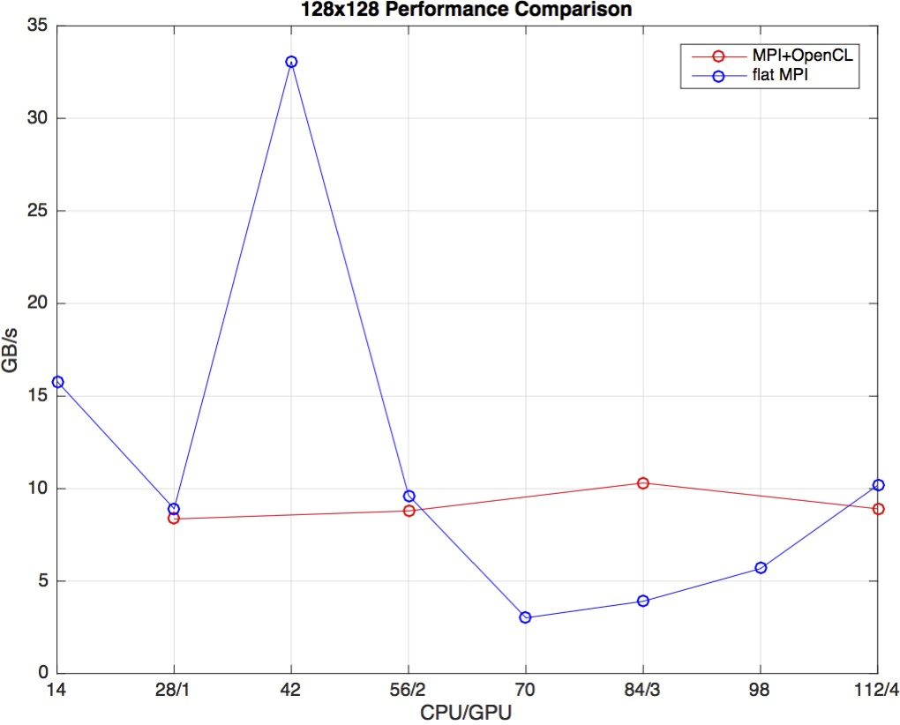
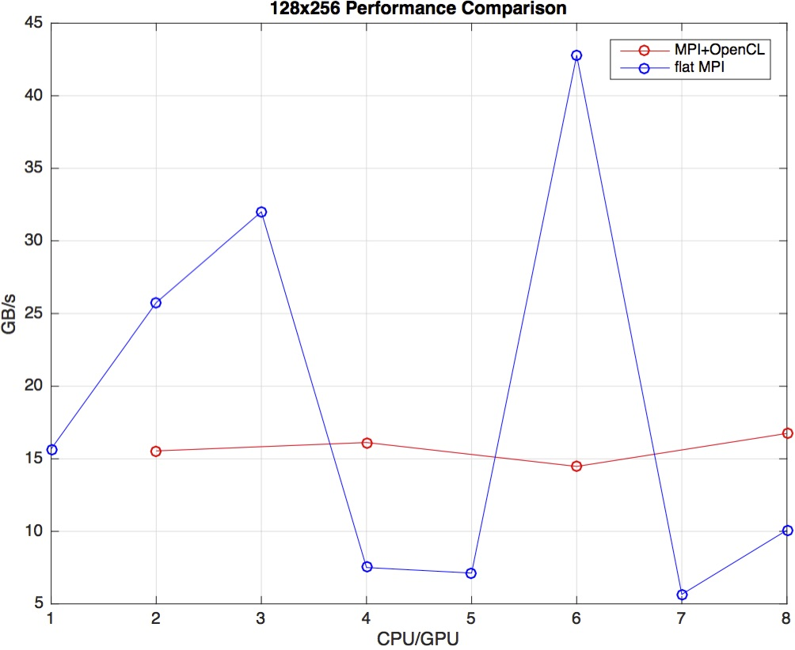
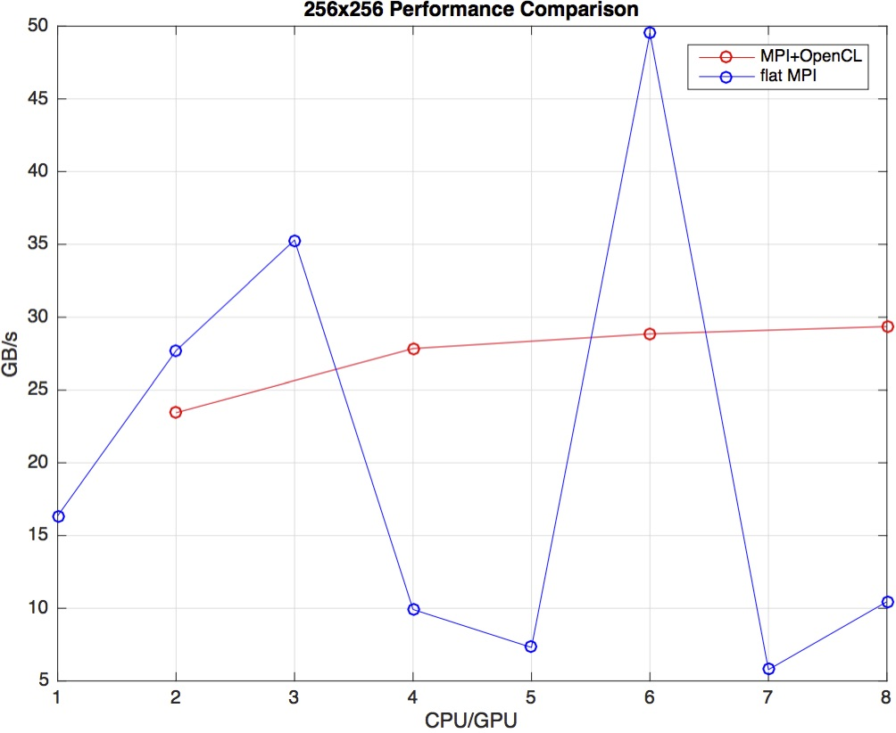
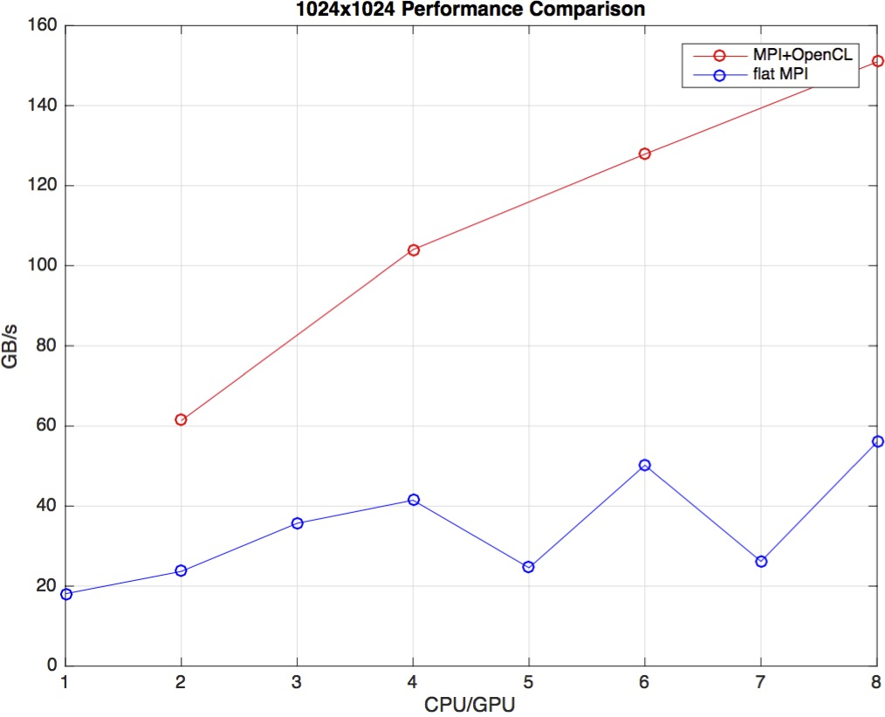

### Performance Comparsions

When processing a small amount of data, the bandwidth growth along with GPUs of MPI+OpenCL is not significant while flat MPI fluctuates. The performance of flat MPI is not the best on full 4 nodes. Perhaps it is due to memory alignment and more frequent communication between processes. The performances of MPI+OpenCL are almost the same form 1 GPU to 4 GPUs, and it may be because the data amount is small.

When data amount is relatively huge, the performances varies significantly. When dealingwith 1024x1024, the advantage of GPU shows up and bandwidth grows a lot under multipleGPUs.

In conclusion, the performance varies with data amount. When it is small, flat MPI canperform better while MPI+OpenCL can be better due to the advantage of GPU when dataamount is huge.

​				

**Test plantform:  BlueCrystal Phase 4**

Phase 4 is primarily intended for large parallel jobs and for work requiring the Nvidia P100 GPUs.

Phase 4 has the following technology:

- Each of the 525 Lenovo nx360 m5 compute nodes has two 14 core 2.4 GHz Intel E5-2680 v4 (Broadwell) CPUs, and 128 GiB of RAM.
- There are 17 extra high memory nodes, each of which has 512 GiB of RAM.
- There are 32 GPU nodes with two cards each, plus 1 GPU in a login node, totalling 65 GPUs.
  ​	

https://www.acrc.bris.ac.uk/acrc/phase4.htm
